<h1>Quertimizer</h1>


<p align="left">
  
</p>

이 문서는 SQL 학습 서비스 [Quertimizer](https://www.quertimizer.com)의 서버단 구조 및 기능을 설명합니다.<br><br>


<br>

## 목차

- [기술 구성](#기술-구성)
- [Architecture](#architecture)
- [핵심 기능](#핵심-기능)
- [서비스 기능](#서비스-기능)
- [Monitoring & Logging](#monitoring--logging)
- [Deployment](#deployment)
- [Test](#test)

<br>

## 기술 구성

- Frontend : React 19, TypeScript, Vite
- Backend : Java 17, Spring Boot 3.5, Spring MVC, Spring Security, Spring Data JPA, Spring WebSocket, JUnit
- DB : PostgreSQL, MySQL, Elasticsearch
- Infra : Google Cloud Platform, Google DNS, Nginx, Let's Encrypt, Docker

<br>

## Architecture

<p align="center">
  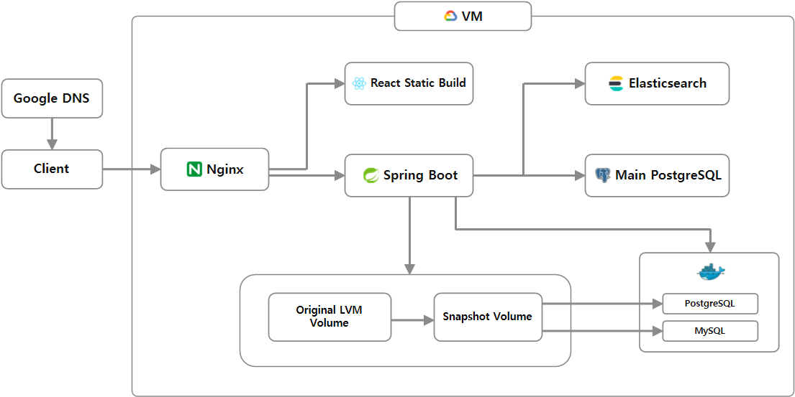
</p>

> Infra Architecture 구성도를 나타낸 그림입니다.

<br>

Google DNS에서 도메인이 VM을 바라보도록 설정했고 Nginx에서 요청을 React, Spring Boot로 라우팅합니다.

일반적인 서비스 기능은 Main PostgreSQL, Elasticsearch 조합으로 처리하고, SQL 풀이 흐름은 이 영역과 분리합니다.<br>
SQL 풀이가 필요할 때는 Original LVM Volume에서 Snapshot Volume을 만들고 Docker 내부의 PostgreSQL/MySQL DB 프로세스가 이를 데이터 영역으로 사용합니다.

<br>
<br>

<p align="center">
  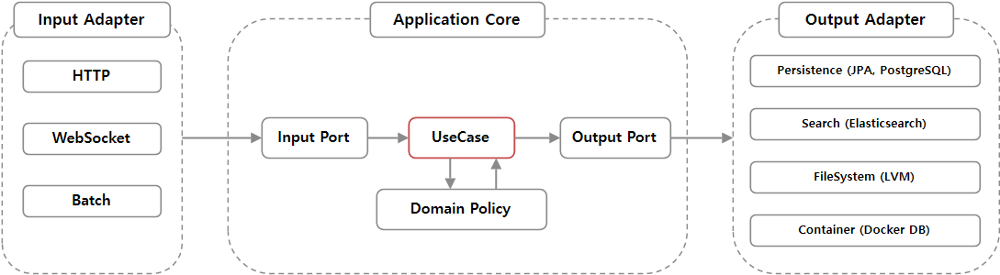
</p>

> 서버단은 DDD & Hexagonal Architecture 디자인 패턴을 적용했습니다.<br>
> 위 그림은 서버 내부의 입력 어댑터, Application Core, 출력 어댑터 구성을 나타냅니다.

<br>

**입력 어댑터**는 Application 외부 요청을 Application Core의 입력 포트로 전달하는 경계입니다.<br>
주요 입력 어댑터 항목은 다음과 같습니다.

- Controller : 문제, 제출, 랭킹, 커뮤니티, 사용자, 관리자 기능에 대한 HTTP API 요청을 받아 요청 형식을 변환합니다.
- WebSocket endpoint : SQL 실행, 문제 제출, 실행 취소, 화면 이탈처럼 진행 상태 전달이 필요한 요청을 받아 처리합니다.
- Scheduler / Batch : 시스템 내부에서 주기적으로 실행되거나 비동기로 처리되어야 하는 작업을 Application Core로 전달합니다.<br>

입력 어댑터는 외부 요청을 직접 처리하지 않고, 요청 값을 Application Core가 이해할 수 있는 입력 모델로 변환한 뒤 입력 포트로 전달합니다.<br><br>

**Application Core**는 DDD 기반으로 기능 경계가 다른 컨텍스트를 나누어 구성했습니다.<br>
주요 컨텍스트 항목은 다음과 같습니다.

- Problem : 문제 메타데이터, 문제 생성, 문제 실행 요청, 문제 제출 요청의 진입 흐름을 다룹니다.
- Judge : SQL 분석, 데이터셋 구성, 격리 실행 데이터베이스 할당, 정답 검증, 실행 계획 비용 측정을 담당합니다.
- Submit : 제출 결과, 제출 SQL 원문, 실행 계획 요소, 제출 이력 조회를 담당합니다.
- Ranking : 정답 제출 결과를 기준으로 문제별 최고 기록과 DBMS별 랭킹을 관리합니다.
- Community : 게시글, 댓글, 태그, 이미지 첨부, 검색 기능을 담당합니다.
- Auth : 이메일 로그인, OAuth2 로그인, 세션, 인증 상태, 권한을 관리합니다.
- Alarm : 알림 템플릿, 알림 저장, 실시간 알림 전달을 담당합니다.
- Monitoring : 서버 리소스, SQL 실행 환경 상태, 로그 조회를 제공합니다.
- User : 프로필, 활동 이력, 계정 상태 관리를 담당합니다.
- UI : 서비스 화면 문구와 UI 표시 데이터를 관리합니다.<br>

각 컨텍스트 내부의 유스케이스는 필요한 도메인 정책을 적용한 뒤 저장, 검색, SQL 실행처럼 외부 기술이 필요한 작업을 출력 포트로 위임합니다.<br><br>

**출력 어댑터**는 Application Core의 출력 포트를 구현하는 영역입니다.<br>
주요 기술 구현 항목은 다음과 같습니다.
- Main PostgreSQL / JPA : 문제, 제출, 랭킹, 사용자, 커뮤니티, 알림 등 일반 서비스 데이터 저장과 조회에 사용합니다.
- Spring Session JDBC : 로그인 세션 저장과 세션 기반 인증 상태 관리에 사용합니다.
- Elasticsearch : 문제와 커뮤니티 게시글 검색에 사용합니다.
- OAuth2 Provider : 외부 OAuth 로그인을 처리하기 위해 사용합니다.
- WebSocket(STOMP) : SQL 실행 진행 상태, 문제 제출 진행 상태, 실시간 알림 전달에 사용합니다.
- FileSystem : 커뮤니티 이미지 첨부 파일 관리와 서버 로그 조회에 사용합니다.
- Micrometer : 서버 리소스와 SQL 실행 환경 상태 지표 수집에 사용합니다.
- OS Shell : Docker DB 프로세스 제어와 LVM snapshot 생성/정리에 사용합니다.
- JDBC : Docker DB 프로세스에 연결해 사용자 SQL 실행, 정답 검증, 실행 계획 비용 측정에 사용합니다.<br>

출력 어댑터는 외부 기술 구현을 Application Core 밖으로 분리하여, 유스케이스가 구체적인 저장소, 검색 엔진, 실행 환경 제어 방식에 직접 의존하지 않도록 구성했습니다.<br><br>

## 핵심 기능

이 프로젝트는 사용자가 정답 확인뿐 아니라 인덱스 추가, 힌트 등을 통해 쿼리를 튜닝하고 결과를 분석해보도록 하는 데에 목적이 있습니다.<br>

하나의 공용 DB에서 모든 SQL을 실행하면 사용자 간 영향이 발생할 수 있습니다.<br>
특정 사용자의 DDL이나 임시 변경이 다른 사용자의 실행 결과에 영향을 줄 수 있기 때문에, 사용자별로 격리된 실행 환경이 필요합니다.<br>

쿼리 튜닝 효과를 유의미하게 확인하려면 테이블 성격별로 백만 단위까지의 데이터를 준비해야 합니다.<br>
하지만 실행 환경마다 대용량 데이터를 새로 적재하는 방식은 시간과 저장 공간 측면에서 비효율적입니다.<br>

같은 쿼리에 대해서는 가능한 한 일정한 실행 계획 비용을 반환해야 합니다.<br>
실행 환경마다 비용이 크게 달라진다면, 사용자가 비교하는 비용이 쿼리 개선 결과인지 외부 요인 차이인지 판단하기 어렵기 때문입니다.<br>

아래에서는 이 문제들을 해결하기 위해 SQL 문제 생성, 실행, 제출 흐름을 어떻게 설계하고 구현했는지 설명합니다.<br><br>


<details>
<summary><strong>대용량 데이터셋 공유</strong></summary>

<br>

<p align="center">
  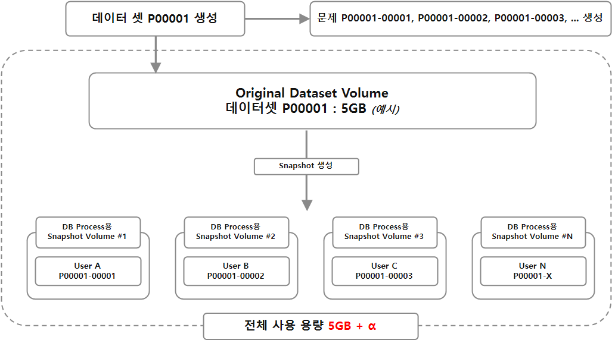
</p>

> 대용량 데이터셋을 문제/유저 단위로 중복 생성하지 않고 공유하는 구조를 나타낸 그림입니다.

<br>

데이터셋은 수십만 행에서 수백만 행으로, 문제마다 동일한 데이터를 새로 적재하면 생성 시간과 디스크 사용량이 크게 증가합니다.<br>

이를 줄이기 위해 같은 테이블 구조와 데이터를 사용하는 문제는 하나의 데이터셋으로 묶고, 여러 문제 번호가 같은 데이터셋을 참조하도록 구성했습니다.<br>
예를 들어 **P00001-00001**, **P00001-00002**, **P00001-00003**처럼 서로 다른 지문과 정답 SQL을 가진 문제도 앞부분 Prefix가 같다면 **P00001** 데이터셋을 공유합니다.<br>

그림의 **Original Dataset Volume**은 문제 생성 단계에서 한 번 만들어지는 원본 데이터 저장 영역입니다.<br>
사용자가 문제를 실행하거나 제출할 때는 이 볼륨을 통째로 복사하지 않고, 실행별 **Snapshot Volume**을 만들어 DB Process가 사용하도록 합니다.<br>
Snapshot Volume은 원본 데이터는 공유하고 인덱스 DDL이나 임시 변경으로 달라진 블록만 추가로 기록하므로, 여러 사용자가 같은 데이터셋 기반의 여러 문제를 풀더라도 전체 데이터를 반복 적재하지 않습니다.<br>

</details>

<br>

<details>
<summary><strong>사용자 간 SQL 실행 격리</strong></summary>

<br>

<p align="center">
  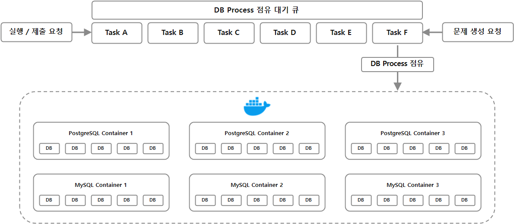
</p>

> SQL 실행 요청을 대기열과 격리 실행 환경을 통해 처리하는 구조를 나타낸 그림입니다.

<br>

사용자 SQL은 서비스 데이터베이스에서 직접 실행하지 않습니다.<br>
실행/제출 요청과 문제 생성 요청은 먼저 **DB Process** 점유 대기 큐에 등록되고, 사용할 수 있는 DB process가 생기면 Docker container 내부의 격리된 실행 환경으로 이동합니다.<br>

Queue는 Java 내부적으로 **Deque**으로 구현했습니다.<br>
문제 생성은 데이터셋과 정답 기준을 먼저 준비해야 하는 작업이므로 우선순위를 부여해 대기열의 맨 앞에 넣고, 문제 실행/제출 요청은 일반 작업으로 뒤쪽에 등록합니다.<br>

Docker container는 요청마다 새로 만들지 않고 DBMS별 실행 컨테이너로 유지합니다.<br>
그림처럼 PostgreSQL/MySQL 컨테이너 묶음을 나누고, 각 container 내부의 DB process를 제한된 실행 자원으로 점유하도록 구성해 동시에 들어오는 SQL 요청이 VM 자원을 무제한으로 사용하지 않도록 했습니다.<br>

DB Process를 실행할 컨테이너는 DBMS별 **Round-robin** 방식으로 선택합니다.<br>
PostgreSQL 요청은 PostgreSQL queue에서, MySQL 요청은 MySQL queue에서 순서를 기다리고, 자기 차례가 되면 해당 DBMS의 container 중 하나에서 DB Process를 실행합니다.<br>
  
실행이 끝나면 DB process 종료, mount 해제, snapshot 삭제, port 반환, 실행 자원 반환 순서로 실행 환경을 정리하고, 정리에 실패한 snapshot은 정리용 batch가 돌면서 다시 확인하고 삭제를 재시도합니다.<br>

</details>

<br>

<details>
<summary><strong>Cost 측정 일관성 유지</strong></summary>

<br>

<p align="center">
  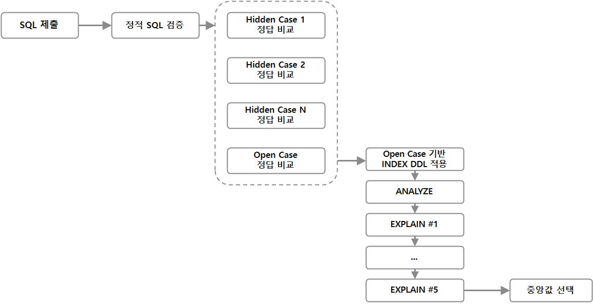
</p>

> 정답 검증과 공식 Cost 측정을 분리하고 측정 조건을 통제하는 구조를 나타낸 그림입니다.

<br>

공식 제출의 성능 비교 기준은 실행 시간이 아니라 DB optimizer가 계산한 실행 계획 Cost입니다.<br>
실행 시간은 OS cache, DB buffer cache, VM 부하, 디스크 I/O, 동시 실행 요청 상태에 따라 쉽게 흔들릴 수 있기 때문입니다.<br>

PostgreSQL : DB process 시작 시 planner/statistics 설정을 고정하고, ANALYZE 결과가 snapshot에 포함되도록 관리합니다.

- **autovacuum=off** : background autovacuum/analyze가 통계 상태나 실행 환경을 바꾸는 것을 막습니다.
- **default_statistics_target=1000** : 통계 목표치를 높여 행 수 추정값의 품질을 높입니다. 
- **jit=off** : JIT 컴파일 여부에 따라 실행 특성이 달라지는 것을 막습니다.
- **seq_page_cost=1.0** : sequential scan 비용 기준을 고정합니다.
- **random_page_cost=4.0** : random page 접근 비용 기준을 고정합니다.
- **cpu_tuple_cost=0.01** : tuple 처리 비용 기준을 고정합니다.
- **cpu_index_tuple_cost=0.005** : index tuple 처리 비용 기준을 고정합니다.
- **cpu_operator_cost=0.0025** : operator 평가 비용 기준을 고정합니다.

MySQL : InnoDB 통계와 session optimizer 조건이 실행마다 흔들리지 않도록 고정합니다.

- **innodb-stats-persistent=ON** : InnoDB 통계를 영구 통계 정보로 유지합니다.
- **innodb-stats-auto-recalc=OFF** : 통계 자동 재계산으로 실행 계획이 바뀌는 상황을 막습니다.
- **innodb-stats-persistent-sample-pages=8192** : 통계 생성 sample page 수를 늘려 행 수 추정값의 품질을 높입니다.
- **eq-range-index-dive-limit=0** : index dive 제한값으로 행 수 추정값이 흔들리는 것을 줄입니다.
- **eq_range_index_dive_limit=0** : session 단위에서도 같은 optimizer 조건을 유지합니다.

Cost 측정 : DBMS별 설정과 통계 갱신이 끝난 뒤 실행 계획을 측정하고 Cost를 선택합니다.

- **ANALYZE > EXPLAIN 5회** : DBMS별 설정과 통계 갱신이 끝난 뒤 실행 계획을 5회 측정합니다.
- **중앙값 선택** : 일시적인 Cost 흔들림을 줄이기 위해 측정값 중 중앙값을 공식 Cost로 저장합니다.

PostgreSQL과 MySQL은 실행 계획 형식과 Cost 표현 방식이 다르기 때문에 서로 직접 비교하지 않고 DBMS별로 분리해서 기록합니다.

</details>

<br>

<details>
<summary><strong>문제 생성</strong></summary>

<br>

<p align="center">
  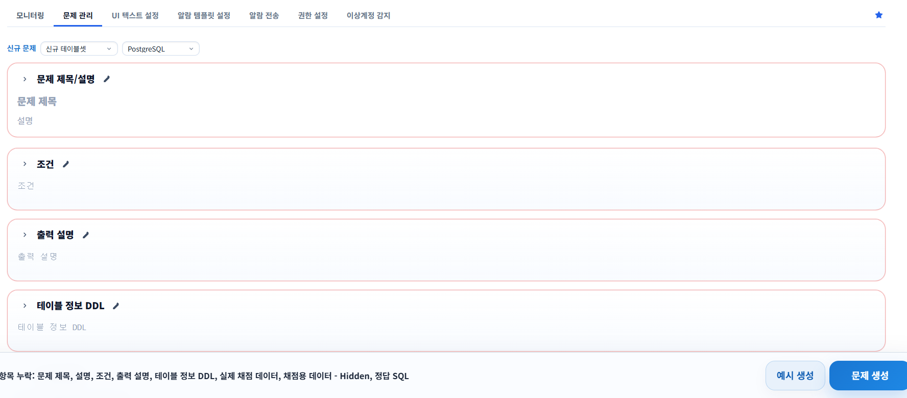
</p>

> 문제 지문, DDL, 데이터 SQL, 정답 SQL, 공개/숨김 케이스를 등록하는 관리자 화면입니다.

<br>

관리자는 이 화면에서 문제 제목, 설명, 조건, 출력 설명, DBMS, DDL, 데이터 SQL, 정답 SQL을 함께 입력합니다.<br>

문제 생성 단계에서는 기존 데이터셋을 재사용할지, 신규 데이터셋을 만들지 결정하고, 이후 정답 SQL 실행 결과를 기준으로 채점 기준을 만듭니다.<br>

<br>

<p align="center">
  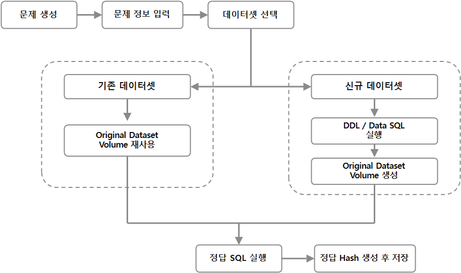
</p>

> 문제 생성 흐름을 나타내는 그림입니다.

<br>

문제 생성은 데이터셋 준비 방식에 따라 두 흐름으로 나뉩니다.<br>

기존 데이터셋을 사용하는 경우 이미 만들어진 Original Dataset Volume을 재사용하고, 신규 데이터셋을 사용하는 경우 DDL과 Data SQL을 실행해 새 Original Dataset Volume을 만듭니다.<br>

데이터셋 준비가 끝나면 정답 SQL을 실행하고, 실행 결과를 row count와 hash로 저장하는데, 이 때 정답을 hash로 저장하는 이유는 LIMIT 없는 SELECT 결과가 수백만 행까지 커질 수 있고 이를 통채로 보관하면 불필요하게 저장 공간을 많이 차지하기 때문입니다.<br>

문제 생성이 끝나면 문제 메타데이터, 예시 데이터, 출력 예시와 정답 hash값들이 함께 저장됩니다.<br>

</details>

<br>

<details>
<summary><strong>문제 실행</strong></summary>

<br>

<p align="center">
  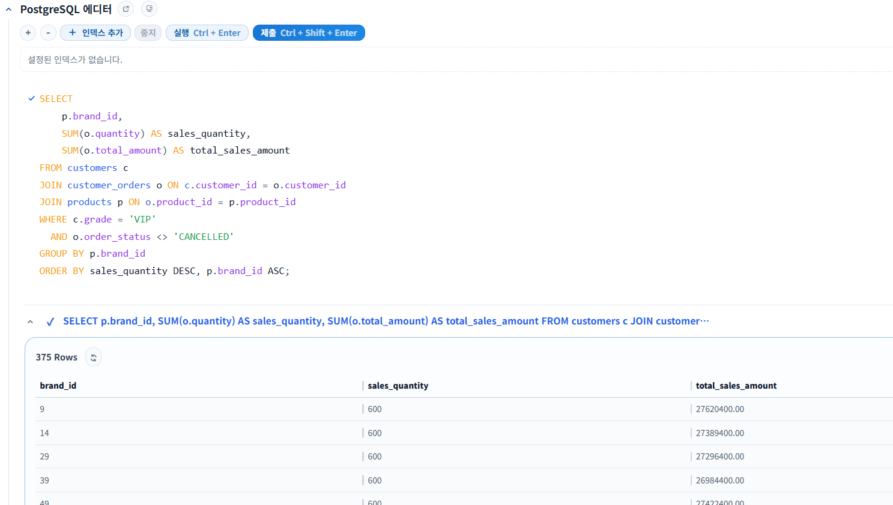
</p>

> 사용자가 SQL을 입력하고 실행할 수 있는 화면입니다.

<br>

문제 실행 흐름은 아래와 같습니다.

1. SQL / Index 입력 : 사용자는 문제 풀이 화면에서 SELECT SQL과 index 설정을 입력합니다.<br>
2. 실행 요청 등록 : 서버는 요청을 DBMS별 대기열에 등록한 후 사용 가능한 DB process 실행 자원이 생길 때까지 순서를 기다립니다.<br>
3. 격리 실행 환경 준비 : 실행 순서가 되면 격리된 실행 환경을 만듭니다.<br>
4. SQL 실행 : index 설정이 있으면 먼저 적용한 뒤 유저가 입력한 SQL을 실행합니다.<br>
5. 결과 반환 : EXPLAIN의 경우 DB에서 반환하는 실행계획이 그대로 출력되고, SELECT의 경우 데이터가 표 형식으로 보여집니다.<br>
6. 실행 환경 정리 : 실행이 끝나면 점유했던 DB process 자원을 반환해 다음 요청이 사용할 수 있도록 정리합니다.

</details>

<br>

<details>
<summary><strong>문제 제출</strong></summary>

<br>

<p align="center">
  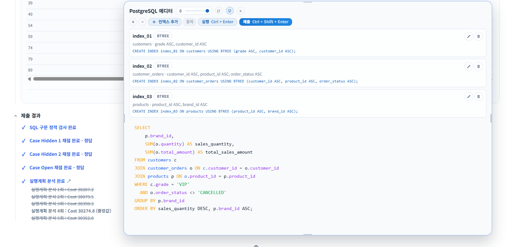
</p>

> 사용자가 SQL을 제출한 뒤 정답 여부, 실행 계획 요소, Cost를 확인하는 화면입니다.

<br>

문제 제출은 정답을 확인하고 실행계획을 분석하는 단계가 추가됩니다.

1. 제출 SQL 검증 : 허용되지 않은 문장을 차단하고, index DDL과 SELECT를 분리합니다.<br>
2. Case별 정답 비교 : Hidden Case와 Open Case를 각각 격리된 환경에서 실행하고, 사용자 SQL 결과 hash와 정답 hash를 비교합니다.<br>
3. 정답 여부 확인 : 한 case라도 오답이거나 DB 오류가 발생하면 남은 case와 Cost 측정을 진행하지 않고 제출 실패로 저장합니다.<br>
4. Cost 측정 준비 : 모든 case를 통과하면 Open Case를 가지고 있는 실행 환경에 index DDL을 적용합니다.<br>
5. ANALYZE / EXPLAIN 반복 : index 적용 후 **ANALYZE → EXPLAIN**을 한 묶음으로 5회 반복해 실행 계획 Cost를 측정합니다.<br>
6. 기록 반영 : 5회 측정값 중 중앙값을 공식 Cost로 저장하고, 제출 이력과 최고 기록, DBMS별 랭킹에 반영합니다.

**비용은 절대적인 성능 점수가 아니라** 같은 문제와 같은 DBMS 안에서 쿼리 변화의 영향을 읽기 위함을 목적으로 합니다.

</details>

<br>

## 서비스 기능

SQL 문제 풀이 외에도 사용자 활동, 커뮤니티, 운영 관리를 위한 기능을 함께 구현했습니다.<br><br>

<details>
<summary><strong>인증</strong></summary>

<br>

<p align="center">
  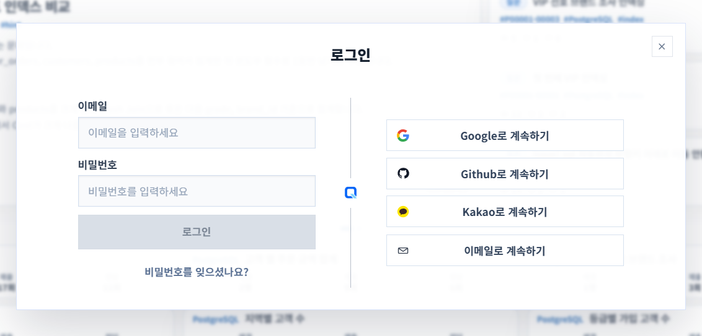
</p>

> 이메일 로그인과 OAuth2 로그인을 제공하는 로그인 화면입니다.

<br>

인증은 이메일 로그인과 OAuth2 로그인을 함께 제공합니다.<br>
세션은 Spring Session JDBC로 데이터베이스에 저장하였습니다.<br>

권한은 일반 사용자와 관리자 기능이 분리되도록 적용되어서, 관리자 요소가 화면단에 노출되지 않고 SecurityFilter를 통해서도 관리자 검증을 수행합니다.<br>

</details>

<br>

<details>
<summary><strong>랭킹</strong></summary>

<br>

<p align="center">
  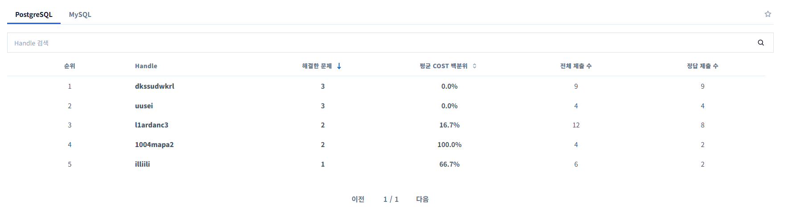
</p>

> 문제별 최고 기록과 DBMS별 순위를 확인하는 화면입니다.

<br>

사용자는 랭킹 화면에서 문제별 최고 기록을 확인하고, 자신의 제출 비용이 어느 정도 위치에 있는지 비교할 수 있습니다.<br>
랭킹은 문제 풀이 수, 실행 계획 비용 2가지를 기준으로 따로 관리됩니다.<br>

PostgreSQL과 MySQL은 옵티마이저 특성과 비용 체계가 다르기 때문에 DBMS별로 분리해서 비교합니다.<br>

</details>

<br>

<details>
<summary><strong>프로필</strong></summary>

<br>

<p align="center">
  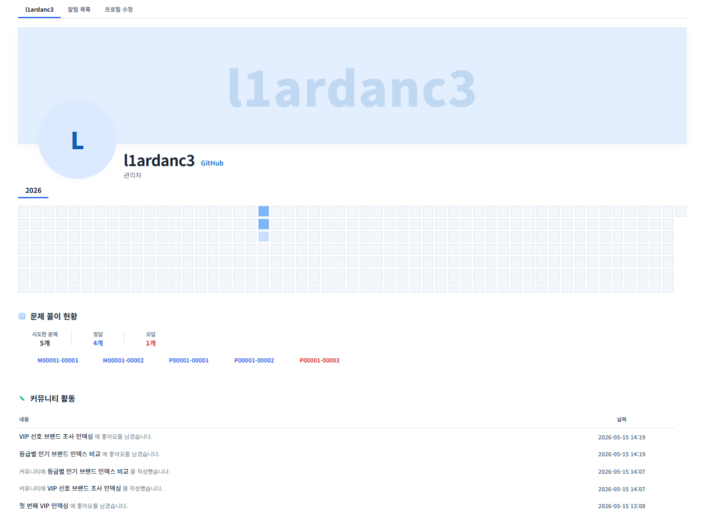
</p>

> 사용자 기본 정보와 활동 이력을 확인하는 프로필 화면입니다.

<br>

프로필에서는 사용자의 기본 정보, 제출 활동, 즐겨찾기, 풀이 이력을 확인할 수 있습니다.<br>

</details>

<br>

<details>
<summary><strong>커뮤니티</strong></summary>

<br>

<p align="center">
  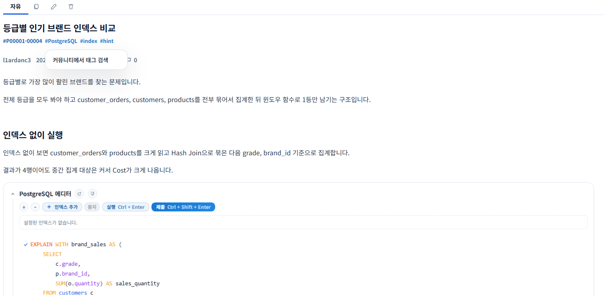
</p>

> 게시글 본문, 댓글, 좋아요, 이미지 첨부 결과를 확인하는 화면입니다.

<br>

사용자는 커뮤니티 상세 화면에서 SQL 풀이 과정이나 실행 계획 비교 내용을 글과 댓글로 공유할 수 있습니다.<br>
게시글, 댓글, 태그, 좋아요, 이미지 첨부 기능을 제공하고, 게시글 구현에는 **Tiptap editor**를 사용했습니다.<br>
게시글 검색은 Elasticsearch를 우선 사용하고, Elasticsearch를 사용할 수 없는 경우에는 DB에서 조회한 게시글 목록을 애플리케이션 메모리에서 필터링/정렬해 기본 목록 조회가 가능하도록 구성했습니다.<br>

</details>

<br>

<details>
<summary><strong>알림</strong></summary>

<br>

<p align="center">
  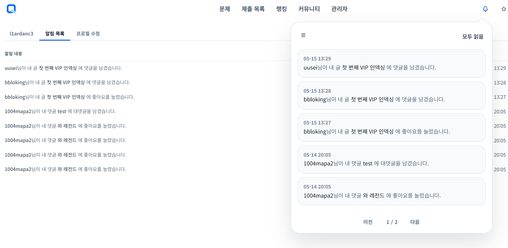
</p>

> 사용자가 받은 알림 목록 화면입니다.

<br>

게시글 좋아요, 댓글, 대댓글 및 관리자에 의한 전송 이벤트가 발생하면 알림 이벤트가 생성되고, 사용자가 접속 중인 경우 WebSocket을 통해 실시간으로 전달합니다.<br>

</details>

<br>

## Monitoring & Logging

<p align="center">
  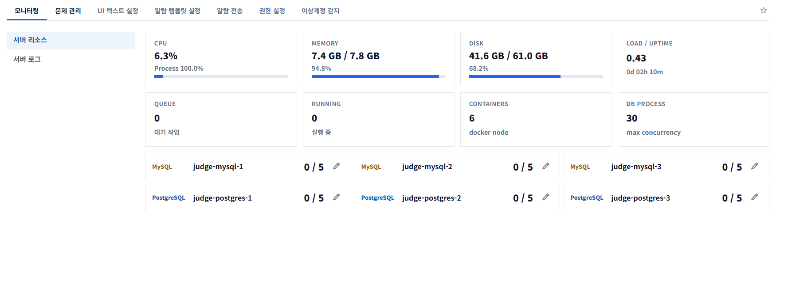
</p>

> CPU, 메모리, 디스크, SQL 실행 환경 상태를 확인하는 관리자 모니터링 화면입니다.

<br>

SQL 채점 서비스는 일반 API 서버보다 SQL 실행 환경의 자원 상태에 영향을 많이 받습니다.<br>
때문에 관리자 화면에서 서버 리소스와 SQL 실행 환경 상태를 함께 모니터링 할 수 있도록 구성했습니다.<br>

Micrometer 기반 지표와 관리자 모니터링 화면을 통해 다음 항목을 확인할 수 있습니다.<br>

| 항목 | 설명 |
| --- | --- |
| CPU | CPU 사용률 |
| MEMORY | 메모리 사용량 |
| DISK | 디스크 사용량 |
| LOAD / UPTIME | CPU/IO 대기 작업을 포함한 load average와 서버 가동 시간을 확인합니다 |
| QUEUE | SQL 실행 대기 작업 수를 확인합니다 |
| RUNNING | 현재 실행 중인 SQL 작업 수를 확인합니다 |
| CONTAINERS | SQL 실행 환경을 제공하는 Docker 컨테이너 수를 확인합니다 |
| DB PROCESS | 최대로 점유 가능한 DB process 갯수입니다. |

DB PROCESS의 경우 컨테이너 별로 관리자가 런타임에 수정 가능하도록 구성되어 있습니다.<br>

<br>
<br>

<p align="center">
  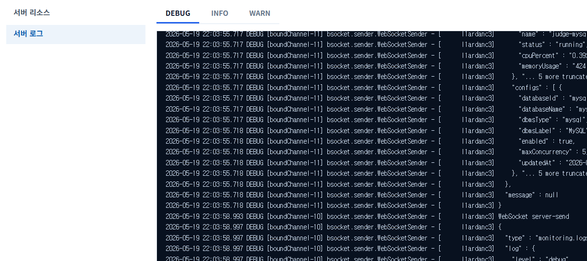
</p>

> 서버 로그 조회 화면 입니다.

<br>

Slf4j/Logback 기반 로깅에 MDC를 적용해 요청 단위 handle/IP를 로그 prefix로 남기도록 구성하였고, 주요 유스케이스는 **@Log** 커스텀 애노테이션과 AOP로 시작/완료/오류 흐름을 기록해 **grep**으로 추적하기 쉽게 했습니다.<br>

<br>

## Deployment

```groovy
tasks.register('deployServer') {
    group = 'deployment'
    dependsOn tasks.named('bootJar')
}

tasks.register('deployClient') {
    group = 'deployment'
}

tasks.register('deployAll') {
    group = 'deployment'
    dependsOn tasks.named('deployServer'), tasks.named('deployClient')
}

tasks.named('deployClient') {
    mustRunAfter tasks.named('deployServer')
}
```

> 서버 jar 배포와 React 정적 빌드 반영은 Gradle task로 묶어 실행합니다.

<br>

**deployServer**는 Spring Boot jar를 서버 release directory에 업로드하고 current symlink를 교체한 뒤 서버 프로세스를 재시작합니다.<br>
**deployClient**는 React 정적 빌드를 생성하고 Nginx가 바라보는 release directory에 반영한 뒤 Nginx 설정 검증과 reload를 수행합니다.<br>
**deployAll**은 서버와 클라이언트 배포 순서를 하나의 작업으로 묶습니다.<br>

<br>

## Test

테스트는 통합 테스트 중심으로 구성했습니다.<br>

```groovy
sourceSets {
    testUnit {
        java.srcDirs = ['src/test-unit/java']
        resources.srcDirs = ['src/test-unit/resources']
    }

    testIntegration {
        java.srcDirs = ['src/test-integration/java']
        resources.srcDirs = ['src/test-integration/resources']
    }
}

tasks.register('unitTest', Test) {
    description = 'Runs unit tests.'
    group = 'verification'
    dependsOn tasks.named('testUnitClasses')
}

tasks.register('integrationTest', Test) {
    description = 'Runs integration tests.'
    group = 'verification'
    dependsOn tasks.named('testIntegrationClasses')
    shouldRunAfter tasks.named('unitTest')
}

tasks.named('test') {
    dependsOn tasks.named('unitTest'), tasks.named('integrationTest')
}
```

> Unit Test와 Integration Test를 별도 sourceSet과 Gradle task로 분리한 구성입니다.

<br>

**JUnit 5**를 사용했고 **Given-When-Then** 패턴으로 테스트 코드를 작성했습니다.<br>
**Given**에서 시나리오와 데이터를 구성하고, **When**에서 요청 또는 유스케이스를 실행한 뒤, **Then**에서 응답, 저장 결과, 상태 변화를 검증합니다.<br>

주요 확인 범위는 다음과 같습니다.

- 인증과 세션
- 문제 조회와 문제 생성
- 문제 실행 및 WebSocket 진행 상태
- 문제 제출과 제출 이력
- 랭킹
- 커뮤니티 게시글/댓글/검색
- 관리자 기능
- 모니터링 API
